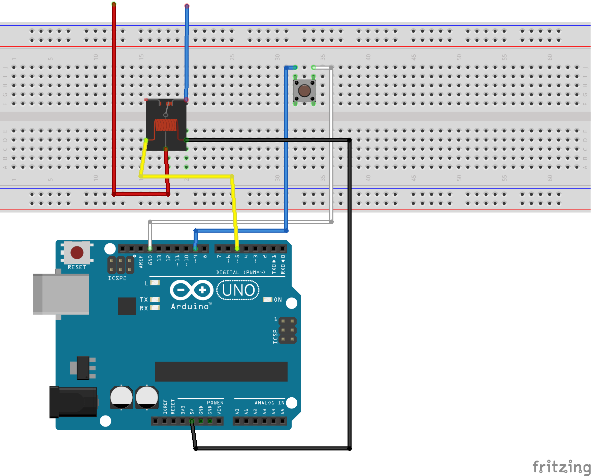

# arduino-ignore-button

This code is for an art project. The button will start the device, but ignore any extra button presses for a set amount of time.

You can read more about it here:   
https://www.jjerome.com/2019/07/03/using-arduino-to-ignore-button-presses/

